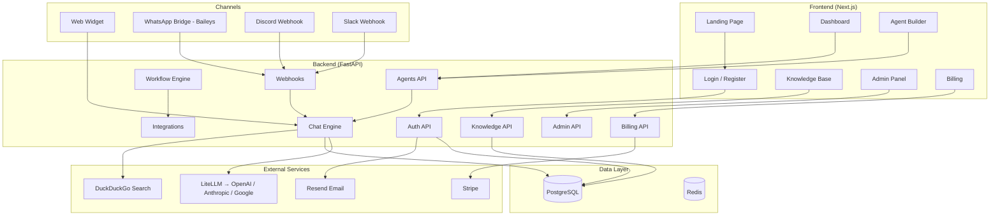
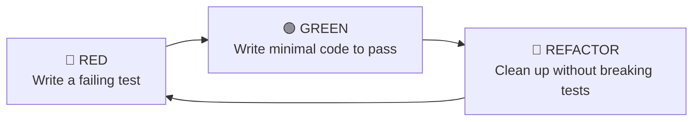

# 🚀 Botlixio — Complete Rebuild Plan (TDD Approach)

> **Goal**: Rebuild the Botlixio AI Agent Platform from scratch — cleaner architecture, better code, and deep understanding of every piece.

---

## 📋 Project Overview

**Botlixio (a.k.a. AIWrapper)** is a full-stack SaaS platform that lets users create, configure, and deploy custom AI chatbot agents across multiple channels. Here's what it includes:

| Layer | Technology | Purpose |
|-------|-----------|---------|
| **Backend** | FastAPI + Python 3.12 | REST API, business logic, AI orchestration |
| **Frontend** | Next.js 16 + React 19 + TypeScript | Dashboard, landing page, admin panel |
| **Database** | PostgreSQL 16 (async via SQLAlchemy) | Persistent storage |
| **Cache** | Redis 7 | Session caching, rate limiting |
| **Auth** | JWT (python-jose) + bcrypt | User authentication |
| **AI** | LiteLLM (multi-provider) | OpenAI, Anthropic, Google LLM calls |
| **Payments** | Stripe | Subscriptions & billing |
| **Email** | Resend | Verification & password reset emails |
| **Channels** | WhatsApp (Baileys), Discord, Slack | Multi-channel bot deployment |
| **Infra** | Docker Compose + Nginx + Certbot | Containerization, reverse proxy, SSL |

### Core Features
1. **User Auth** — Register, login, email verification, password reset, OAuth (Google/GitHub/Apple)
2. **Agent Builder** — Create AI agents with custom prompts, models, tools, and temperatures
3. **Knowledge Base** — Upload files (PDF/TXT/CSV/DOCX), scrape URLs, add raw text → RAG context
4. **Chat Engine** — Session-tracked LLM conversations with tool-calling (web search, weather, lead catcher)
5. **Multi-Channel Deploy** — Website widget, WhatsApp (QR pairing), Discord, Slack webhooks
6. **Lead Capture** — Automatic lead extraction from conversations
7. **Workflow Engine** — Trigger → Action automation with integrations (Gmail, Notion, Telegram, etc.)
8. **Admin Panel** — User management, API key management, analytics, pricing config, tools/channels management
9. **Billing** — Stripe subscriptions with plan-based limits (agents, messages, model access)
10. **Embeddable Widget** — Public chat endpoint for websites (no auth required)

---

## 🏗️ Architecture Diagram



---

## 🗺️ Phase-wise Development Roadmap

> [!IMPORTANT]
> Each phase follows **TDD**: Write failing tests first → Implement minimal code to pass → Refactor.

---

### Phase 0: Project Scaffolding & DevOps Foundation
**Duration**: ~1 day  
**Goal**: Set up a clean project structure with testing infrastructure

#### What to Build
- Clean monorepo structure (`backend/`, `frontend/`, `docker/`, `docs/`)
- Python virtual environment + `pyproject.toml` (modern packaging over [requirements.txt](file:///Users/aman/Documents/botlixio/backend/requirements.txt))
- Docker Compose for PostgreSQL + Redis (dev)
- `pytest` + `pytest-asyncio` + `httpx` test infrastructure
- Database migration setup with Alembic (missing in original!)
- CI-ready test runner configuration

#### Core Concepts to Learn
- 📖 **Python project structure** — `pyproject.toml` vs [requirements.txt](file:///Users/aman/Documents/botlixio/backend/requirements.txt)
- 📖 **Docker Compose** — Service orchestration, health checks, volumes
- 📖 **Alembic** — Database migration management (the original project lacks this!)
- 📖 **pytest** — Fixtures, async testing, conftest patterns

#### Tests to Write
```python
# tests/conftest.py — Test database setup
# - Fixture: async test database engine (SQLite or test PostgreSQL)
# - Fixture: async session for each test
# - Fixture: FastAPI test client (httpx.AsyncClient)

# tests/test_health.py
# - test_health_endpoint_returns_200
# - test_root_endpoint_returns_app_info
```

#### Improvements Over Original
| Original | Rebuild |
|----------|---------|
| [requirements.txt](file:///Users/aman/Documents/botlixio/backend/requirements.txt) | `pyproject.toml` with dependency groups |
| No Alembic migrations | Full migration chain from day one |
| No test infrastructure | `pytest` + `conftest.py` + factory fixtures |
| Hardcoded DB URL in code | Environment-based config with validation |

---

### Phase 1: Configuration & Database Foundation
**Duration**: ~1–2 days  
**Goal**: Build a robust, testable configuration and database layer

#### What to Build
- `app/core/config.py` — Settings with Pydantic v2 `BaseSettings`
- `app/core/database.py` — Async engine, session maker, [Base](file:///Users/aman/Documents/botlixio/backend/app/database.py#12-14), dependency
- `app/models/` — Empty [Base](file:///Users/aman/Documents/botlixio/backend/app/database.py#12-14) class, first test model
- Alembic initial migration

#### Core Concepts to Learn
- 📖 **Pydantic Settings v2** — `.env` loading, validation, type coercion
- 📖 **SQLAlchemy 2.0 async** — `AsyncSession`, `create_async_engine`, `DeclarativeBase`
- 📖 **Dependency Injection** — FastAPI's `Depends()` pattern
- 📖 **The Repository Pattern** — Separating data access from business logic (improvement over original)

#### Tests to Write
```python
# tests/test_config.py
# - test_settings_loads_defaults
# - test_settings_loads_from_env
# - test_settings_validates_required_fields

# tests/test_database.py
# - test_db_session_creates_and_closes
# - test_get_db_yields_session
```

#### Improvements Over Original
| Original | Rebuild |
|----------|---------|
| `datetime.utcnow` (deprecated) | `datetime.now(UTC)` |
| `Column()` style (SQLAlchemy 1.x) | `Mapped[]` + `mapped_column()` (SQLAlchemy 2.0) |
| No repository layer | Separate `repositories/` for data access |
| Settings cached with `@lru_cache` | Settings as proper singleton with `@lru_cache` + testable override |

---

### Phase 2: Authentication System
**Duration**: ~2–3 days  
**Goal**: Complete auth with JWT, password hashing, and email verification

#### What to Build
- [app/models/user.py](file:///Users/aman/Documents/botlixio/backend/app/models/user.py) — User model with `Mapped[]` annotations
- `app/schemas/auth.py` — Pydantic request/response schemas
- `app/services/auth_service.py` — Business logic (separate from routes!)
- `app/api/v1/auth.py` — Route handlers (thin controllers)
- `app/core/security.py` — JWT creation/verification, password hashing
- `app/services/email_service.py` — Verification & reset emails

#### Core Concepts to Learn
- 📖 **JWT tokens** — Access vs refresh tokens, token expiry, claims
- 📖 **Password hashing** — bcrypt, why [verify()](file:///Users/aman/Documents/botlixio/frontend/src/lib/api.ts#46-47) not `==`
- 📖 **HTTP Bearer auth** — FastAPI's `HTTPBearer` security scheme
- 📖 **Service layer pattern** — Separating business logic from route handlers
- 📖 **Email verification flow** — Token generation, email sending, verification

#### Tests to Write (TDD Order)
```python
# 1. Unit Tests — app/services/
# tests/unit/test_security.py
# - test_hash_password_returns_hash
# - test_verify_password_correct
# - test_verify_password_incorrect
# - test_create_access_token_has_exp_claim
# - test_create_access_token_has_sub_claim
# - test_decode_token_returns_payload
# - test_decode_expired_token_raises

# tests/unit/test_auth_service.py
# - test_register_creates_user
# - test_register_duplicate_email_raises
# - test_login_returns_tokens
# - test_login_invalid_credentials_raises

# 2. Integration Tests — app/api/
# tests/integration/test_auth_api.py
# - test_register_success_201
# - test_register_duplicate_email_409
# - test_register_invalid_email_422
# - test_login_success_200
# - test_login_wrong_password_401
# - test_get_me_authenticated_200
# - test_get_me_unauthenticated_401
# - test_verify_email_success
# - test_forgot_password_sends_email
# - test_reset_password_success
```

#### Improvements Over Original
| Original | Rebuild |
|----------|---------|
| Auth logic mixed in route handlers (~320 lines in [auth.py](file:///Users/aman/Documents/botlixio/backend/app/api/auth.py)) | Service layer: `auth_service.py` for logic, thin route handlers |
| [get_current_user](file:///Users/aman/Documents/botlixio/backend/app/middleware/auth.py#41-66) duplicated in [middleware/auth.py](file:///Users/aman/Documents/botlixio/backend/app/middleware/auth.py) and [api/auth.py](file:///Users/aman/Documents/botlixio/backend/app/api/auth.py) | Single source of truth in `core/security.py` |
| OAuth state not validated properly | Proper OAuth state parameter with CSRF protection |
| No refresh token rotation | Refresh token rotation for security |

---

### Phase 3: Agent CRUD & Core Models
**Duration**: ~2–3 days  
**Goal**: Build the agent management system with full CRUD

#### What to Build
- [app/models/agent.py](file:///Users/aman/Documents/botlixio/backend/app/models/agent.py) — Agent model with proper types
- [app/models/subscription.py](file:///Users/aman/Documents/botlixio/backend/app/models/subscription.py) — Subscription model with plan limits
- `app/schemas/agent.py` — Pydantic schemas (create, update, response)
- `app/repositories/agent_repo.py` — Data access layer
- `app/services/agent_service.py` — Business logic (plan limit checks, etc.)
- `app/api/v1/agents.py` — Route handlers

#### Core Concepts to Learn
- 📖 **REST API design** — Resource naming, HTTP methods, status codes
- 📖 **Pydantic model inheritance** — Base → Create → Update → Response schemas
- 📖 **UUID primary keys** — Why UUIDs, `uuid4`, PostgreSQL UUID type
- 📖 **JSONB columns** — Storing structured data (tools, configs) in PostgreSQL
- 📖 **Plan-based access control** — Checking subscription limits before creating resources

#### Tests to Write (TDD Order)
```python
# 1. Unit Tests
# tests/unit/test_agent_service.py
# - test_create_agent_within_limit
# - test_create_agent_exceeds_limit_raises
# - test_update_agent_partial_fields
# - test_delete_agent_success
# - test_deploy_agent_changes_status_to_live
# - test_pause_agent_changes_status_to_paused

# 2. Integration Tests
# tests/integration/test_agents_api.py
# - test_list_agents_empty_200
# - test_create_agent_201
# - test_create_agent_unauthorized_401
# - test_get_agent_200
# - test_get_agent_not_found_404
# - test_get_agent_belongs_to_other_user_403
# - test_update_agent_200
# - test_delete_agent_204
# - test_deploy_agent_200
# - test_pause_agent_200
```

#### Improvements Over Original
| Original | Rebuild |
|----------|---------|
| Schemas defined inside [agents.py](file:///Users/aman/Documents/botlixio/backend/app/api/agents.py) routes file (~1060 lines!) | Separate `schemas/agent.py` |
| No repository pattern | `repositories/agent_repo.py` for data access |
| `mutable default` for JSONB `default=[]` and `default={}` | Use `default_factory=list` / `default_factory=dict` |
| `datetime.utcnow` | `func.now()` for server-side timestamps |

---

### Phase 4: Chat Engine (The Heart of the App)
**Duration**: ~3–4 days  
**Goal**: Build the core LLM chat pipeline with session tracking

#### What to Build
- [app/models/chat_session.py](file:///Users/aman/Documents/botlixio/backend/app/models/chat_session.py) — ChatSession + ChatMessage models
- [app/services/chat_engine.py](file:///Users/aman/Documents/botlixio/backend/app/services/chat_engine.py) — Full LLM pipeline (session → context → LLM → save)
- `app/services/llm_client.py` — LiteLLM wrapper (abstraction over providers)
- Chat session management (create/get/clear sessions by IP)
- Token/message usage accounting

#### Core Concepts to Learn
- 📖 **LLM APIs** — Chat completions, messages format, system/user/assistant roles
- 📖 **LiteLLM** — Multi-provider abstraction (OpenAI, Anthropic, Google via single interface)
- 📖 **Session management** — Tracking conversations per user/IP
- 📖 **Token accounting** — Counting usage, enforcing plan limits
- 📖 **Prompt engineering** — System prompts, context injection

#### Tests to Write (TDD Order)
```python
# 1. Unit Tests
# tests/unit/test_llm_client.py
# - test_format_messages_for_litellm
# - test_build_system_prompt_includes_agent_config
# - test_build_system_prompt_with_knowledge_context

# tests/unit/test_chat_engine.py
# - test_creates_new_session_for_new_ip
# - test_reuses_existing_session_for_same_ip
# - test_appends_messages_to_session
# - test_increments_message_count
# - test_exceeds_message_limit_raises
# - test_builds_conversation_history

# 2. Integration Tests (with mocked LLM)
# tests/integration/test_chat_api.py
# - test_chat_with_agent_returns_reply
# - test_chat_creates_session
# - test_chat_preserves_history
# - test_get_chat_session_messages
# - test_clear_chat_session
```

#### Improvements Over Original
| Original | Rebuild |
|----------|---------|
| 370-line monolithic [execute_agent_chat()](file:///Users/aman/Documents/botlixio/backend/app/services/chat_engine.py#58-371) | Smaller, composable functions: `build_context()`, `call_llm()`, `save_response()` |
| LLM logic tightly coupled | Separate `llm_client.py` wrapper (testable, mockable) |
| Error handling via print statements | Proper structured logging |
| No response time tracking | Add timing with `time.perf_counter()` |

---

### Phase 5: Tool System (Web Search, Weather, Lead Catcher)
**Duration**: ~2–3 days  
**Goal**: Implement the LLM function-calling / tool-use pipeline

#### What to Build
- `app/services/tools/base.py` — Abstract tool interface
- `app/services/tools/web_search.py` — DuckDuckGo search + webpage fetching
- `app/services/tools/weather.py` — Weather lookup
- `app/services/tools/lead_catcher.py` — Lead extraction from conversations
- `app/services/tools/registry.py` — Tool registration & dispatch
- Tool calling loop in chat engine (LLM decides when to call tools)

#### Core Concepts to Learn
- 📖 **LLM function calling** — Tool schemas, how LLMs request tool execution
- 📖 **Tool calling loop** — LLM → tool call → execute → feed result → LLM
- 📖 **Abstract base classes** — Designing extensible tool interfaces
- 📖 **Web scraping** — BeautifulSoup for HTML parsing
- 📖 **Strategy pattern** — Registry-based tool dispatch

#### Tests to Write (TDD Order)
```python
# 1. Unit Tests
# tests/unit/test_web_search.py
# - test_search_returns_results (mock httpx)
# - test_search_handles_no_results
# - test_search_handles_network_error
# - test_fetch_webpage_extracts_text (mock httpx)
# - test_fetch_webpage_truncates_long_content

# tests/unit/test_lead_catcher.py
# - test_parse_lead_token_extracts_fields
# - test_parse_lead_saves_to_db
# - test_parse_lead_strips_token_from_reply

# tests/unit/test_tool_registry.py
# - test_get_tool_by_slug
# - test_unknown_tool_raises
# - test_list_all_tools

# 2. Integration Tests
# tests/integration/test_tool_calling.py
# - test_agent_with_web_search_tool_calls_search
# - test_agent_with_no_tools_skips_tool_calling
# - test_tool_calling_loop_max_iterations
```

#### Improvements Over Original
| Original | Rebuild |
|----------|---------|
| Tool schemas hardcoded in [chat_engine.py](file:///Users/aman/Documents/botlixio/backend/app/services/chat_engine.py) | Separate [tools/](file:///Users/aman/Documents/botlixio/backend/app/api/admin.py#427-450) module with registry |
| Tools tightly coupled in chat engine | Each tool is an independent class |
| No max iteration guard on tool loop | Add configurable max iterations |
| Lead parsing via regex in chat engine | Dedicated `lead_catcher.py` service |

---

### Phase 6: Knowledge Base (RAG)
**Duration**: ~2–3 days  
**Goal**: Implement document ingestion and retrieval for agent context

#### What to Build
- `app/models/knowledge.py` — AgentKnowledge model
- `app/services/knowledge_service.py` — File parsing, URL scraping, text storage
- `app/services/document_parser.py` — PDF, TXT, CSV, DOCX extraction
- `app/api/v1/knowledge.py` — Upload file, scrape URL, add text, list, delete
- RAG context injection into chat engine

#### Core Concepts to Learn
- 📖 **RAG (Retrieval-Augmented Generation)** — What it is, why it matters
- 📖 **Document parsing** — Extracting text from PDFs (PyPDF2), DOCX, CSV
- 📖 **Text chunking** — Breaking documents into manageable pieces
- 📖 **Context window management** — Fitting knowledge into LLM context limits
- 📖 **File uploads** — FastAPI `UploadFile`, multipart forms

#### Tests to Write (TDD Order)
```python
# 1. Unit Tests
# tests/unit/test_document_parser.py
# - test_parse_pdf_extracts_text
# - test_parse_txt_extracts_text
# - test_parse_csv_extracts_text
# - test_parse_unsupported_format_raises
# - test_parse_empty_file_returns_empty

# tests/unit/test_knowledge_service.py
# - test_add_text_knowledge
# - test_scrape_url_extracts_content (mock httpx)
# - test_chunk_count_calculation
# - test_delete_knowledge_item

# 2. Integration Tests
# tests/integration/test_knowledge_api.py
# - test_upload_pdf_201
# - test_upload_unsupported_type_400
# - test_scrape_url_201
# - test_add_text_201
# - test_list_knowledge_200
# - test_delete_knowledge_204
# - test_knowledge_injected_into_chat_context
```

#### Improvements Over Original
| Original | Rebuild |
|----------|---------|
| All parsing logic in route handler (329 lines in [knowledge.py](file:///Users/aman/Documents/botlixio/backend/app/api/knowledge.py)) | Separate `document_parser.py` and `knowledge_service.py` |
| [mock_chunk_count()](file:///Users/aman/Documents/botlixio/backend/app/api/knowledge.py#47-53) — fake chunking | Implement actual text chunking |
| URL scraping has 140+ lines of inline code | Clean `url_scraper.py` service |
| No file size validation before parsing | Validate size + type early |

---

### Phase 7: Embeddable Widget (Public Chat)
**Duration**: ~1–2 days  
**Goal**: Build public chat endpoints that work without authentication

#### What to Build
- Public agent status endpoint (`GET /api/agents/{id}/widget-status`)
- Public chat endpoint (`POST /api/agents/{id}/widget-chat`)
- Public session restore endpoint
- Rate limiting for public endpoints
- CORS configuration for widget embedding

#### Core Concepts to Learn
- 📖 **Public vs authenticated endpoints** — When to skip auth
- 📖 **Rate limiting** — `slowapi` for request throttling
- 📖 **CORS** — Cross-Origin Resource Sharing for embeddable widgets
- 📖 **IP-based sessions** — Using client IP for session tracking

#### Tests to Write
```python
# tests/integration/test_widget_api.py
# - test_widget_status_returns_agent_name
# - test_widget_status_agent_not_found_404
# - test_widget_chat_no_auth_required
# - test_widget_chat_agent_offline_returns_offline
# - test_widget_chat_rate_limited_429
# - test_widget_chat_creates_session
```

---

### Phase 8: Subscription & Billing
**Duration**: ~2–3 days  
**Goal**: Implement Stripe-based subscription management

#### What to Build
- [app/models/subscription.py](file:///Users/aman/Documents/botlixio/backend/app/models/subscription.py) — Subscription model with plan enum
- `app/services/billing_service.py` — Stripe integration, plan management
- `app/api/v1/billing.py` — Plans, checkout, webhook, cancel
- Plan-based limit enforcement (agents, messages, model access)
- Pricing configuration (file-backed, admin-editable)

#### Core Concepts to Learn
- 📖 **Stripe integration** — Checkout sessions, webhooks, subscription lifecycle
- 📖 **Webhook security** — Verifying Stripe webhook signatures
- 📖 **Plan-based access control** — Enforcing limits at service layer
- 📖 **Pricing strategy** — Tiered plans (Free → Starter → Growth → Business)

#### Tests to Write
```python
# tests/unit/test_billing_service.py
# - test_load_plans_returns_defaults
# - test_load_plans_from_config_file
# - test_get_plan_limits_for_free_plan
# - test_check_agent_limit_within_bounds
# - test_check_agent_limit_exceeded
# - test_check_message_limit_exceeded

# tests/integration/test_billing_api.py
# - test_list_plans_200
# - test_get_subscription_200
# - test_create_checkout_session (mock Stripe)
# - test_stripe_webhook_updates_subscription (mock Stripe)
# - test_cancel_subscription_200
```

---

### Phase 9: Integration & Workflow Engine
**Duration**: ~3–4 days  
**Goal**: Build the pluggable integration system and workflow automation

#### What to Build
- [app/services/integrations/base.py](file:///Users/aman/Documents/botlixio/backend/app/services/integrations/base.py) — Abstract integration interface
- `app/services/integrations/` — Telegram, Gmail, Slack, Notion, etc.
- [app/services/integrations/registry.py](file:///Users/aman/Documents/botlixio/backend/app/services/integrations/registry.py) — Integration registry
- [app/models/workflow.py](file:///Users/aman/Documents/botlixio/backend/app/models/workflow.py) — Workflow, WorkflowStep, Execution models
- [app/services/workflow_engine.py](file:///Users/aman/Documents/botlixio/backend/app/services/workflow_engine.py) — Sequential step execution engine
- `app/api/v1/workflows.py` — Workflow CRUD + execution
- `app/api/v1/integrations.py` — Connect, disconnect, list integrations

#### Core Concepts to Learn
- 📖 **Plugin architecture** — Abstract base class + registry pattern
- 📖 **Workflow orchestration** — Sequential step execution with error handling
- 📖 **Credential encryption** — Fernet symmetric encryption for stored secrets
- 📖 **Third-party APIs** — Telegram Bot API, Gmail API, Notion API
- 📖 **Webhook design** — Incoming webhook endpoints for external services

#### Tests to Write
```python
# tests/unit/test_integration_base.py
# - test_integration_has_required_interface
# - test_registry_returns_correct_integration
# - test_registry_raises_for_unknown

# tests/unit/test_workflow_engine.py
# - test_execute_workflow_runs_all_steps
# - test_execute_workflow_inactive_raises
# - test_execute_workflow_quota_exceeded_raises
# - test_execute_workflow_step_failure_marks_failed
# - test_retry_execution_increments_counter
# - test_retry_execution_max_retries_reached

# tests/unit/test_encryption.py
# - test_encrypt_decrypt_roundtrip
# - test_decrypt_invalid_data_raises

# tests/integration/test_workflows_api.py
# - test_create_workflow_201
# - test_list_workflows_200
# - test_activate_workflow_200
# - test_pause_workflow_200
# - test_delete_workflow_204
# - test_list_executions_200
```

#### Improvements Over Original
| Original | Rebuild |
|----------|---------|
| Credential encryption key derivation is fragile | Properly validate Fernet key at startup |
| `can_run_workflow` property missing from Subscription model | Add as computed property |
| Integration [execute_action](file:///Users/aman/Documents/botlixio/backend/app/services/integrations/providers.py#317-321) implementations are stubs | Implement actual API calls with proper error handling |

---

### Phase 10: Admin Panel API
**Duration**: ~2–3 days  
**Goal**: Build comprehensive admin management endpoints

#### What to Build
- `app/api/v1/admin.py` — User management, analytics, API keys, pricing
- Admin middleware (`require_admin` dependency)
- Global API key management (encrypted storage)
- Platform analytics (user counts, agent counts, message volumes)
- Tools and channels management CRUD
- AI model access control by plan

#### Core Concepts to Learn
- 📖 **Role-based access control (RBAC)** — Admin vs regular user permissions
- 📖 **Platform analytics** — Aggregate queries with SQLAlchemy
- 📖 **Configuration management** — File-backed JSON configs
- 📖 **API key management** — Storing/masking/rotating platform API keys

#### Tests to Write
```python
# tests/integration/test_admin_api.py
# - test_admin_list_users_200
# - test_non_admin_list_users_403
# - test_admin_block_user
# - test_admin_change_role
# - test_admin_analytics_returns_stats
# - test_admin_save_api_key
# - test_admin_list_api_keys_masked
# - test_admin_delete_api_key
# - test_admin_update_pricing
# - test_admin_crud_tools
# - test_admin_crud_channels
```

---

### Phase 11: Multi-Channel Webhooks
**Duration**: ~2–3 days  
**Goal**: Handle incoming messages from WhatsApp, Discord, Slack

#### What to Build
- `app/api/v1/webhooks.py` — WhatsApp, Discord, Slack webhook receivers
- WhatsApp Bridge (Node.js + Baileys) — QR pairing, message relay
- Unified webhook → chat engine pipeline
- Channel-specific session tracking (phone number, Discord user ID, etc.)

#### Core Concepts to Learn
- 📖 **Webhooks** — Receiving HTTP callbacks from external services
- 📖 **WhatsApp Web API** — Baileys library, QR code authentication
- 📖 **Server-Sent Events (SSE)** — Streaming QR codes to frontend
- 📖 **Message normalization** — Converting different channel formats to unified format

#### Tests to Write
```python
# tests/integration/test_webhooks.py
# - test_whatsapp_webhook_valid_message
# - test_whatsapp_webhook_missing_account_400
# - test_whatsapp_webhook_agent_not_found_404
# - test_whatsapp_webhook_agent_paused_ignored
# - test_discord_webhook_valid_message
# - test_slack_webhook_valid_message
# - test_webhook_empty_message_ignored
```

#### Improvements Over Original
| Original | Rebuild |
|----------|---------|
| Near-identical code for WhatsApp/Discord/Slack handlers | Create unified `process_channel_message()` |
| Error handling returns error text to user | Proper error responses with status codes |

---

### Phase 12: Frontend — Landing Page & Auth
**Duration**: ~3–4 days  
**Goal**: Build a stunning landing page and authentication flow

#### What to Build
- Landing page with feature showcase, pricing, testimonials
- Login page, Register page
- Email verification page
- Password reset flow
- OAuth login buttons
- Responsive navigation

#### Core Concepts to Learn
- 📖 **Next.js App Router** — Layouts, pages, metadata
- 📖 **React 19** — Client/server components, hooks
- 📖 **Zustand** — Lightweight state management
- 📖 **Axios interceptors** — Auto-attach tokens, handle 401
- 📖 **Tailwind CSS 4** — Utility-first styling

#### Tests to Write
```typescript
// Frontend testing with React Testing Library / Vitest
// tests/components/LoginForm.test.tsx
// - renders login form
// - shows error on invalid credentials
// - redirects on successful login
// - login button is disabled while loading
```

---

### Phase 13: Frontend — Dashboard & Agent Management
**Duration**: ~3–4 days  
**Goal**: Build the main dashboard with agent CRUD, chat testing, and knowledge management

#### What to Build
- Dashboard layout (sidebar, navigation)
- Dashboard home (stats cards, recent agents)
- Agent list page with status toggles
- Agent creation wizard (multi-step form)
- Agent detail/edit page
- Test chat component
- Knowledge base management UI
- Lead management UI

#### Core Concepts to Learn
- 📖 **Protected routes** — Auth guards in Next.js
- 📖 **Multi-step forms** — Form state management with `react-hook-form`
- 📖 **Real-time chat UI** — Message bubbles, auto-scroll, loading states
- 📖 **File upload UIs** — Drag & drop, progress indicators

---

### Phase 14: Frontend — Admin Panel & Billing
**Duration**: ~2–3 days  
**Goal**: Build admin management interface and billing/upgrade flow

#### What to Build
- Admin panel with tabs (Users, API Keys, Pricing, Tools, Channels, Analytics)
- Recharts analytics dashboard
- Stripe Checkout redirect
- Plan comparison page
- Profile settings page

---

### Phase 15: Production Deployment
**Duration**: ~2 days  
**Goal**: Containerize and deploy with proper production configs

#### What to Build
- Multi-stage Dockerfiles (backend, frontend, WA bridge)
- Production [docker-compose.prod.yml](file:///Users/aman/Documents/botlixio/docker-compose.prod.yml)
- Nginx reverse proxy with SSL (Certbot)
- Environment variable management
- Health checks and monitoring

#### Core Concepts to Learn
- 📖 **Multi-stage Docker builds** — Minimize image size
- 📖 **Nginx reverse proxy** — Routing, SSL termination, WebSocket proxying
- 📖 **Certbot / Let's Encrypt** — Free SSL certificates
- 📖 **Production security** — Secret management, CORS lockdown

---

## 🧪 TDD Methodology Guide

### The Red-Green-Refactor Cycle



### How to Apply TDD in Each Phase

#### Step 1: Write the test FIRST
```python
# Example: Phase 2 - Auth
# tests/unit/test_security.py

def test_hash_password_returns_hash():
    """A hashed password should NOT equal the original."""
    hashed = hash_password("mypassword123")
    assert hashed != "mypassword123"
    assert len(hashed) > 50  # bcrypt hashes are long
```

#### Step 2: Run the test — it FAILS (🔴)
```bash
$ pytest tests/unit/test_security.py -v
# FAILED - ImportError: cannot import 'hash_password'
```

#### Step 3: Write MINIMAL code to pass (🟢)
```python
# app/core/security.py
from passlib.context import CryptContext

pwd_context = CryptContext(schemes=["bcrypt"], deprecated="auto")

def hash_password(password: str) -> str:
    return pwd_context.hash(password)
```

#### Step 4: Run test again — it PASSES (🟢)
```bash
$ pytest tests/unit/test_security.py -v
# PASSED
```

#### Step 5: Refactor if needed (🔵)
Add type hints, docstrings, or reorganize — tests should still pass.

### Testing Layers

| Layer | What to Test | Tools |
|-------|-------------|-------|
| **Unit** | Individual functions, services | `pytest`, mocks |
| **Integration** | API endpoints, DB operations | `httpx.AsyncClient`, test DB |
| **E2E** | Full user flows | Playwright / Cypress (frontend) |

### Key Testing Patterns for This Project

```python
# 1. Async test fixture for database
@pytest_asyncio.fixture
async def db_session():
    async with async_session() as session:
        yield session
        await session.rollback()

# 2. Factory fixture for creating test users
@pytest.fixture
def create_user(db_session):
    async def _create(email="test@example.com", password="test123"):
        user = User(email=email, password_hash=hash_password(password))
        db_session.add(user)
        await db_session.commit()
        return user
    return _create

# 3. Auth helper for protected endpoints
@pytest.fixture
def auth_headers(create_user):
    async def _headers(user=None):
        if not user:
            user = await create_user()
        token = create_access_token({"sub": str(user.id)})
        return {"Authorization": f"Bearer {token}"}
    return _headers

# 4. Mock external services
@pytest.fixture
def mock_litellm(monkeypatch):
    async def mock_completion(**kwargs):
        return {"choices": [{"message": {"content": "Mocked reply"}}]}
    monkeypatch.setattr("litellm.acompletion", mock_completion)
```

---

## 📁 Recommended Project Structure (Rebuild)

```
botlixio-v2/
├── backend/
│   ├── app/
│   │   ├── __init__.py
│   │   ├── main.py                    # FastAPI app factory
│   │   ├── core/
│   │   │   ├── config.py              # Pydantic Settings
│   │   │   ├── database.py            # Async engine, session, Base
│   │   │   └── security.py            # JWT, password hashing
│   │   ├── models/                    # SQLAlchemy models
│   │   │   ├── user.py
│   │   │   ├── agent.py
│   │   │   ├── subscription.py
│   │   │   ├── chat_session.py
│   │   │   ├── knowledge.py
│   │   │   ├── workflow.py
│   │   │   ├── integration.py
│   │   │   ├── tool.py
│   │   │   ├── lead.py
│   │   │   └── channel.py
│   │   ├── schemas/                   # Pydantic request/response schemas
│   │   │   ├── auth.py
│   │   │   ├── agent.py
│   │   │   ├── billing.py
│   │   │   ├── knowledge.py
│   │   │   └── workflow.py
│   │   ├── repositories/              # Data access layer (NEW!)
│   │   │   ├── base.py
│   │   │   ├── user_repo.py
│   │   │   ├── agent_repo.py
│   │   │   └── ...
│   │   ├── services/                  # Business logic
│   │   │   ├── auth_service.py
│   │   │   ├── agent_service.py
│   │   │   ├── billing_service.py
│   │   │   ├── chat_engine.py
│   │   │   ├── knowledge_service.py
│   │   │   ├── document_parser.py
│   │   │   ├── email_service.py
│   │   │   ├── llm_client.py          # LiteLLM wrapper (NEW!)
│   │   │   ├── workflow_engine.py
│   │   │   ├── tools/                 # Tool system (NEW structure!)
│   │   │   │   ├── base.py
│   │   │   │   ├── registry.py
│   │   │   │   ├── web_search.py
│   │   │   │   ├── weather.py
│   │   │   │   └── lead_catcher.py
│   │   │   └── integrations/
│   │   │       ├── base.py
│   │   │       ├── registry.py
│   │   │       ├── telegram.py
│   │   │       ├── gmail.py
│   │   │       ├── slack.py
│   │   │       └── notion.py
│   │   ├── api/
│   │   │   └── v1/                    # Versioned API (NEW!)
│   │   │       ├── auth.py
│   │   │       ├── agents.py
│   │   │       ├── billing.py
│   │   │       ├── knowledge.py
│   │   │       ├── workflows.py
│   │   │       ├── integrations.py
│   │   │       ├── admin.py
│   │   │       ├── webhooks.py
│   │   │       └── profile.py
│   │   └── utils/
│   │       ├── encryption.py
│   │       └── email.py
│   ├── tests/
│   │   ├── conftest.py                # Shared fixtures
│   │   ├── unit/
│   │   │   ├── test_security.py
│   │   │   ├── test_auth_service.py
│   │   │   ├── test_agent_service.py
│   │   │   ├── test_chat_engine.py
│   │   │   ├── test_tool_registry.py
│   │   │   └── ...
│   │   └── integration/
│   │       ├── test_auth_api.py
│   │       ├── test_agents_api.py
│   │       ├── test_billing_api.py
│   │       └── ...
│   ├── alembic/                       # Database migrations (NEW!)
│   │   ├── env.py
│   │   └── versions/
│   ├── alembic.ini
│   ├── pyproject.toml                 # Modern Python packaging (NEW!)
│   ├── Dockerfile
│   └── .env.example
├── frontend/
│   ├── src/
│   │   ├── app/
│   │   ├── components/
│   │   ├── hooks/
│   │   ├── lib/
│   │   └── types/                     # TypeScript interfaces (NEW!)
│   ├── tests/                         # Frontend tests (NEW!)
│   ├── package.json
│   └── Dockerfile
├── whatsapp-bridge/                   # Moved to top-level (cleaner)
│   ├── src/
│   ├── package.json
│   └── Dockerfile
├── docker/
│   ├── docker-compose.yml
│   ├── docker-compose.prod.yml
│   └── nginx/
│       └── nginx.conf
├── docs/                              # Documentation (NEW!)
│   └── api.md
├── .env.example
├── .gitignore
└── README.md
```

---

## 📊 Summary: What's Different in the Rebuild

> [!TIP]
> These improvements aren't just cosmetic — they make the codebase easier to test, debug, extend, and maintain.

| Category | Original | Rebuild |
|----------|----------|---------|
| **Architecture** | Mixed concerns (routes = services = data access) | Clean 4-layer: Routes → Services → Repositories → Models |
| **Testing** | 2 ad-hoc test scripts | Full `pytest` suite with unit + integration tests |
| **Migrations** | None (manual table creation) | Alembic migration chain |
| **API Versioning** | None (`/api/...`) | Versioned (`/api/v1/...`) |
| **Package Management** | [requirements.txt](file:///Users/aman/Documents/botlixio/backend/requirements.txt) | `pyproject.toml` with groups |
| **SQLAlchemy Style** | 1.x `Column()` | 2.0 `Mapped[]` + `mapped_column()` |
| **Timestamps** | `datetime.utcnow` (deprecated) | `datetime.now(UTC)` + server-side `func.now()` |
| **Schemas** | Mixed into route files | Separate `schemas/` directory |
| **Error Handling** | `print()` statements | Structured `logging` module |
| **Type Safety** | Minimal type hints | Full type annotations throughout |
| **Config** | Fragile `@lru_cache` | Testable settings with override support |
| **Code Size** | Giant 1000+ line files | Small, focused modules (<200 lines each) |
| **Frontend Types** | `any` everywhere | Proper TypeScript interfaces |

---

## 🎯 Getting Started Checklist

- [ ] **Phase 0**: Set up project, Docker, pytest
- [ ] **Phase 1**: Config + Database foundation
- [ ] **Phase 2**: Authentication system (TDD)
- [ ] **Phase 3**: Agent CRUD (TDD)
- [ ] **Phase 4**: Chat Engine (TDD)
- [ ] **Phase 5**: Tool System (TDD)
- [ ] **Phase 6**: Knowledge Base / RAG (TDD)
- [ ] **Phase 7**: Widget / Public Chat (TDD)
- [ ] **Phase 8**: Billing / Stripe (TDD)
- [ ] **Phase 9**: Integrations & Workflows (TDD)
- [ ] **Phase 10**: Admin Panel API (TDD)
- [ ] **Phase 11**: Multi-Channel Webhooks (TDD)
- [ ] **Phase 12**: Frontend — Landing + Auth
- [ ] **Phase 13**: Frontend — Dashboard + Agents
- [ ] **Phase 14**: Frontend — Admin + Billing
- [ ] **Phase 15**: Production Deployment

> [!NOTE]
> **Estimated Total Duration**: ~5–6 weeks for a focused developer working full-time, or ~8–10 weeks at part-time pace.

---

*Ready to start? Say **"Let's start Phase 0"** and we'll scaffold the entire project together! 🚀*
